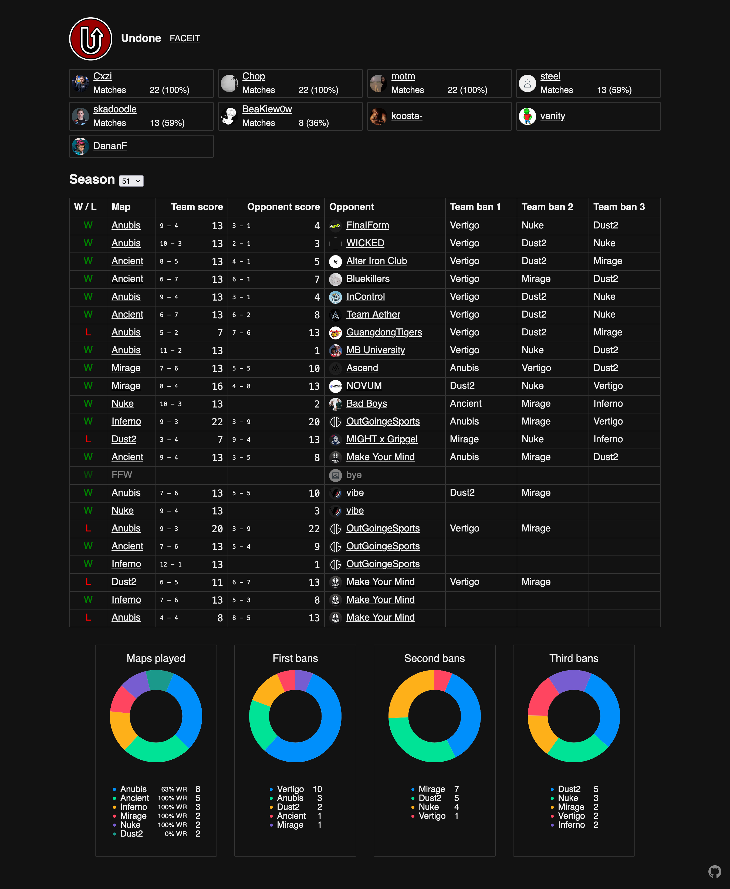

# ESEA.team

Shows basic summary about an ESEA team.
Mainly designed for seeing map pick/ban rate.

Navigate to a team's overview page on FACEIT and change
`www.faceit.com/en/teams` → `esea.team` in your address bar.

